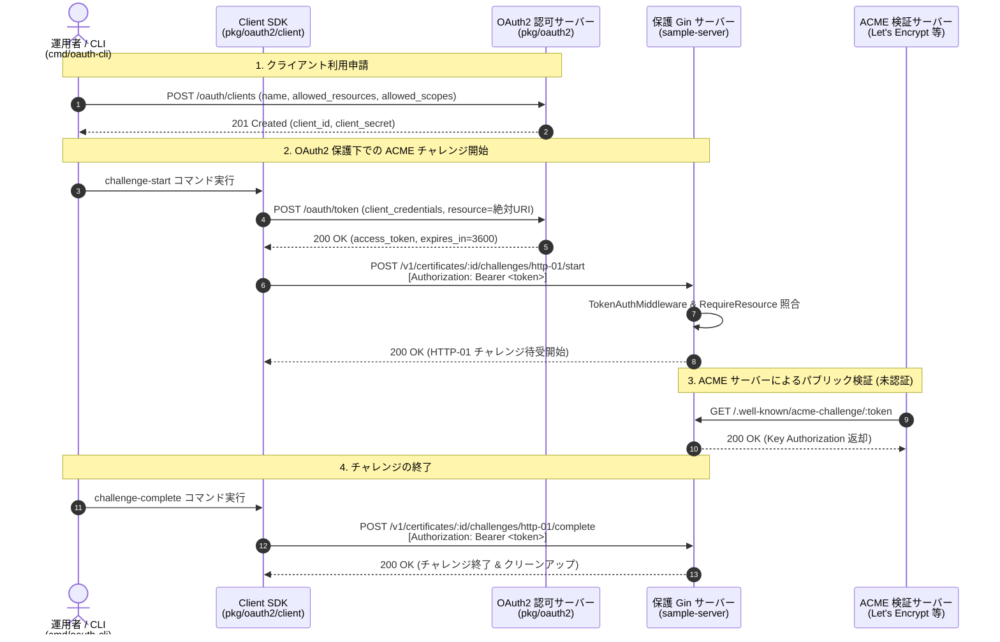

# OAuth 2.0 Client Credentials Grant & ACME Challenge Protection

[](https://github.com/sh0jitmy/go-oauth-client-credentials-grant/actions/workflows/ci.yml)
[](https://goreportcard.com/report/github.com/sh0jitmy/go-oauth-client-credentials-grant)
[](LICENSE)
[](#テスト--品質)

**RFC 8707 (Resource Indicators)** に完全準拠した **OAuth 2.0 Client Credentials Grant (RFC 6749)** 認可サーバー、Gin 保護ミドルウェア、クライアント SDK、および **ACME HTTP-01 Challenge (RFC 8555)** 制御用リファレンス実装を提供するエンタープライズグレードの Go パッケージ & アプリケーションです。

---

## 🌟 主な特徴

1. **RFC 8707 Resource Indicators 準拠の絶対URI検証**:
   - トークン発行時および認可検証時にアクセス対象リソースを「**絶対URI**（例: `https://api.example.com/v1/certificates/cert-001`）」として指定。
   - スキーム・ホストの完全検証、および RFC 8707 Section 2 に従い URI フラグメントを厳格に禁止。
2. **暗号学的 Opaque Access Token & 安全なストレージ管理**:
   - `crypto/rand` を用いた 256-bit エントロピーのセキュアなランダム識別子をトークンとして発行。
   - クライアントシークレットは `bcrypt`、発行済みアクセストークンは `SHA-256` ハッシュ値でインデックス保存し、漏洩リスクを最小化。
3. **他リポジトリから `go get` 可能な独立モジュール (`pkg/oauth2`)**:
   - 内部パッケージ（`internal/` や `ent/`）への依存を一切排除したスタンドアロン設計。
   - 認可サーバー、Gin ミドルウェア (`TokenAuthMiddleware`, `RequireResource`, `RequireScope`)、および `Store` 抽象化インターフェースを提供。
4. **自動キャッシュ＆リフレッシュ機能付き Client SDK (`pkg/oauth2/client`)**:
   - インメモリ TTL キャッシュ、Double-Checked Locking による並行競合防止。
   - 有効期限切れ前のトークン自動再取得と `http.RoundTripper`（Bearer 自動付与）の提供。
5. **ACME HTTP-01 Challenge (RFC 8555) 制御 API のリファレンス実装 (`sample-server/`)**:
   - 内部サービス間での ACME チャレンジの開始 (`/start`)・終了 (`/complete`) を OAuth 2.0 で保護。
   - ACME サーバーによるパブリック検証 (`/.well-known/acme-challenge/:token`) は未認証アクセスを許可。
6. **評価・ハンズオン用 CLI ツール (`cmd/oauth-cli`)**:
   - 利用申請、トークン発行、ACME チャレンジ実行、Introspection、Revocation を即座に体験できる 9 つのサブコマンドを実装。
7. **単体テストカバレッジ 100.0% & プロダクション可観測性**:
   - `pkg/oauth2` (363/363 stmts) および `pkg/oauth2/client` (133/133 stmts) で **100.0% カバレッジ** を達成。
   - OpenTelemetry (Metrics, Traces) 計装、および `slog` 構造化監査ログ（`log_type: "audit"`、トークン平文完全マスキング）。

---

## 📐 システムアーキテクチャ



---

## 📦 パッケージ構成

```text
go-oauth-client-credentials-grant/
├── pkg/
│   ├── oauth2/                   # 【独立モジュール】認可サーバー & Gin ミドルウェア (go get 可能)
│   │   ├── types.go              # データモデル、RFC 8707 絶対URIバリデータ
│   │   ├── store.go              # Store 抽象化インターフェース
│   │   ├── store_memory.go       # スレッドセーフなインメモリストア
│   │   ├── service.go            # Opaque Token 生成、SHA-256、bcrypt、認可照合
│   │   ├── handlers.go           # Gin ハンドラ (利用申請, トークン発行, 検証, 失効)
│   │   ├── middleware.go         # Gin ミドルウェア (TokenAuth, RequireResource, RequireScope)
│   │   ├── telemetry.go          # OpenTelemetry (Metrics/Traces) & slog 監査ログ
│   │   └── *_test.go             # 単体テスト (ステートメントカバレッジ 100.0%)
│   └── oauth2/client/            # 【クライアント SDK】Token キャッシュ & HTTP Transport (go get 可能)
│       ├── client.go             # Token 取得、インメモリTTLキャッシュ、自動再取得
│       ├── transport.go          # http.RoundTripper (Bearer トークン自動付与)
│       └── *_test.go             # 単体テスト (ステートメントカバレッジ 100.0%)
├── sample-server/                # 【リファレンス実装】ACME HTTP-01 チャレンジ制御 Gin サーバー
│   ├── internal/certificate/     # 証明書管理 & ACME チャレンジ (RFC 8555) 実装
│   ├── main.go                   # sample-server 起動・Graceful Shutdown
│   └── e2e_test.go               # フル E2E 自動結合テスト
├── cmd/
│   ├── oauth-cli/                # 【評価用 CLI ツール】client SDK を用いた実動 CLI
│   ├── app/                      # コア REST API サーバー
│   └── web/                      # スタンドアロン HTMX UI ダッシュボード
└── docs/
    ├── oauth2_design.md          # アーキテクチャ設計書 (Mermaid シーケンス4種、プロトコル解説)
    └── oauth2_code_mapping.md    # シーケンス動作と Go 実装コードの完全対応表
```

---

## 🚀 クイックスタート

### 1. サーバーの起動

リファレンス実装の Gin サーバーを起動します（ポート `8080`）：

```bash
go run ./sample-server/main.go
```

### 2. 評価用 CLI (`oauth-cli`) による一連のフロー実行

別ターミナルを開き、以下のコマンドを順に実行します。

```bash
# Step 1: クライアント利用申請 (client_id, client_secret 発行)
go run ./cmd/oauth-cli/main.go register \
  --name "acme-operator" \
  --resources "https://api.example.com/v1/certificates/cert-001" \
  --scopes "cert:read,cert:write"

# 出力された CLIENT_ID, CLIENT_SECRET を環境変数にセット
export CLIENT_ID="<発行されたclient_id>"
export CLIENT_SECRET="<発行されたclient_secret>"

# Step 2: アクセストークンの直接取得 (RFC 8707 resource 指定)
go run ./cmd/oauth-cli/main.go token \
  --client-id "$CLIENT_ID" \
  --client-secret "$CLIENT_SECRET" \
  --resource "https://api.example.com/v1/certificates/cert-001" \
  --scope "cert:read,cert:write"

# Step 3: ACME HTTP-01 チャレンジの開始 (OAuth2 保護 API 呼出)
go run ./cmd/oauth-cli/main.go challenge-start \
  --client-id "$CLIENT_ID" \
  --client-secret "$CLIENT_SECRET" \
  --cert-id "cert-001" \
  --domain "example.com" \
  --token-val "sample-token-123" \
  --key-auth "sample-token-123.auth-key"

# Step 4: ACME サーバーによるパブリック検証 (未認証パブリックアクセス)
go run ./cmd/oauth-cli/main.go challenge-verify \
  --token-val "sample-token-123"

# Step 5: チャレンジの終了 (OAuth2 保護 API 呼出 & クリーンアップ)
go run ./cmd/oauth-cli/main.go challenge-complete \
  --client-id "$CLIENT_ID" \
  --client-secret "$CLIENT_SECRET" \
  --cert-id "cert-001"

# Step 6: トークンの検証 (Introspection) & 失効 (Revocation)
go run ./cmd/oauth-cli/main.go introspect --token "<ACCESS_TOKEN>"
go run ./cmd/oauth-cli/main.go revoke --token "<ACCESS_TOKEN>"
```

---

## 💻 ライブラリとしての利用方法 (`go get`)

### 認可サーバー & ミドルウェアの導入 (`pkg/oauth2`)

```go
package main

import (
    "github.com/gin-gonic/gin"
    "github.com/shjtmy/go-oauth-client-credentials-grant/pkg/oauth2"
)

func main() {
    r := gin.Default()
    store := oauth2.NewMemoryStore()
    oauthService := oauth2.NewService(store)

    // OAuth2 ルート登録 (/oauth/clients, /oauth/token, /oauth/introspect, /oauth/revoke)
    oauth2.RegisterRoutes(r, oauthService)

    // 保護対象エンドポイントへのミドルウェア適用
    api := r.Group("/v1/certificates/:id")
    api.Use(oauth2.TokenAuthMiddleware(oauthService))
    api.Use(oauth2.RequireResource(func(c *gin.Context) string {
        return "https://api.example.com/v1/certificates/" + c.Param("id")
    }))
    api.Use(oauth2.RequireScope("cert:read"))

    api.GET("", func(c *gin.Context) {
        c.JSON(200, gin.H{"status": "authorized"})
    })

    r.Run(":8080")
}
```

### クライアント SDK の利用 (`pkg/oauth2/client`)

```go
package main

import (
    "context"
    "net/http"
    "github.com/shjtmy/go-oauth-client-credentials-grant/pkg/oauth2/client"
)

func main() {
    cli := client.NewClient(client.Config{
        TokenEndpoint: "http://localhost:8080/oauth/token",
        ClientID:      "my-client-id",
        ClientSecret:  "my-client-secret",
    })

    // 1. http.Client 経由での透過的リクエスト (Bearer トークン自動付与 & 自動更新)
    httpClient := cli.HTTPClient()
    req, _ := http.NewRequestWithContext(context.Background(), "GET", "https://api.example.com/v1/certificates/cert-001", nil)
    resp, err := httpClient.Do(req)
    // ...

    // 2. トークン直接取得 (キャッシュ付き)
    token, err := cli.GetToken(context.Background(), "https://api.example.com/v1/certificates/cert-001", "cert:read")
    // ...
}
```

---

## 🧪 テスト & 品質

本リポジトリは厳格な品質基準を設けており、CI においてすべてのチェックが自動検証されます。

```bash
# 単体テスト & カバレッジ検証 (pkg/oauth2 および client が 100.0% であることを検証)
make test

# OAuth2 & ACME HTTP-01 フル結合 E2E テスト
make oauth-e2e

# 静的解析 (0 issues)
make lint

# 全 Go ソースコードの Apache-2.0 ライセンスヘッダー検証
make license-check

# 全バイナリのビルド (app, web, oauth-cli, sample-server)
make build

# GoReleaser v2 設定バリデーション
make release-check
```

### カバレッジ測定サマリー
```text
=========================================
Code Coverage Verification Summary:
=========================================
  Business Logic (service/domain): 11/11 (100.00%)
  OAuth2 Server (pkg/oauth2):      363/363 (100.00%)
  OAuth2 Client SDK (client):      133/133 (100.00%)
=========================================
SUCCESS: All coverage thresholds satisfied!
```

---

## 📖 設計ドキュメント

- [OAuth 2.0 アーキテクチャ設計書 (`docs/oauth2_design.md`)](docs/oauth2_design.md): RFC 6749, RFC 8707, RFC 8555 仕様解説、セキュリティ設計、Mermaid シーケンス 4 種、OpenTelemetry 計装仕様。
- [シーケンス動作・コード対応表 (`docs/oauth2_code_mapping.md`)](docs/oauth2_code_mapping.md): プロトコルシーケンスと実装コード（パッケージ・型・関数）の完全トレーサビリティ対応表。

---

## 📜 ライセンス

本プロジェクトは [Apache-2.0 License](LICENSE) の下で公開されています。
