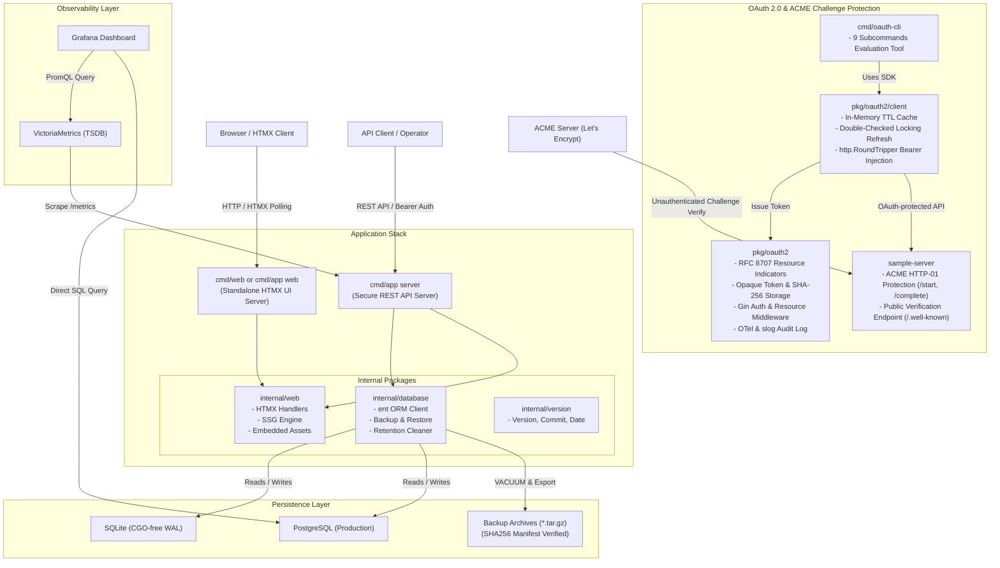
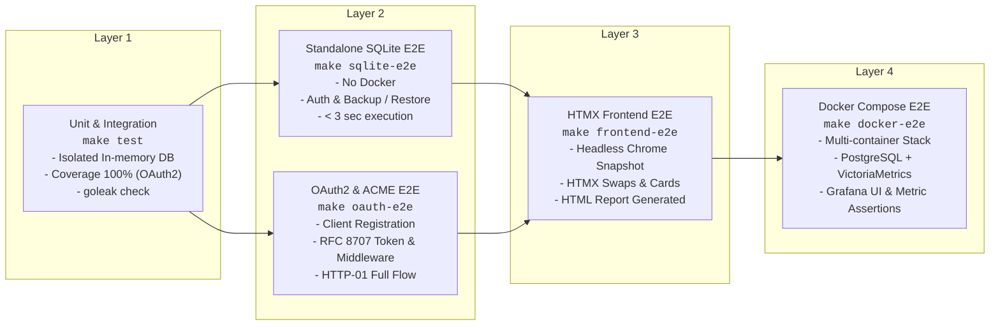

<!--
Copyright 2026 [Copyright Holder]

Licensed under the Apache License, Version 2.0 (the "License");
you may not use this file except in compliance with the License.
You may obtain a copy of the License at

    http://www.apache.org/licenses/LICENSE-2.0

Unless required by applicable law or agreed to in writing, software
distributed under the License is distributed on an "AS IS" BASIS,
WITHOUT WARRANTIES OR CONDITIONS OF ANY KIND, either express or implied.
See the License for the specific language governing permissions and
limitations under the License.

Author: [YOUR_NAME]
-->

# System Architecture & Technical Specifications

本書は、`go_template` のシステム全体アーキテクチャ、コンポーネント構成、データフロー、およびテスト階層について詳述します。

---

## 1. 全体アーキテクチャ概要

---

## 2. コアコンポーネント設計

### 2.1 OAuth 2.0 認可基盤 & ACME チャレンジ保護 (`pkg/oauth2`, `sample-server`, `cmd/oauth-cli`)
- **認可サーバー & ミドルウェア (`pkg/oauth2`)**:
  - `go get` 可能な外部依存フリー設計（`internal/` や `ent/` への依存なし）。
  - RFC 8707 Resource Indicators 準拠の絶対URI検証（フラグメント禁止）。
  - Opaque Token 発行、SHA-256 インデックス保存、bcrypt クライアントシークレット管理。
  - Gin 保護ミドルウェア (`TokenAuthMiddleware`, `RequireResource`, `RequireScope`)。
  - OpenTelemetry (RED/USE メトリクス、Span 属性) および `slog` 平文完全マスキング監査ログ (`log_type: "audit"`)。
- **クライアント SDK (`pkg/oauth2/client`)**:
  - インメモリ TTL キャッシュ、Double-Checked Locking による並行競合防止、有効期限切れ前自動更新。
  - `http.RoundTripper` 実装により、HTTP リクエストの URI から自動的に `resource` を識別して Bearer トークンを自動注入。
- **リファレンス実装 (`sample-server/`)**:
  - ACME HTTP-01 チャレンジ (RFC 8555) の開始 (`/start`)・終了 (`/complete`) を OAuth 2.0 で保護。
  - ACME サーバーによるパブリック検証 (`/.well-known/acme-challenge/:token`) は未認証アクセスを許可。
- **評価用 CLI ツール (`cmd/oauth-cli`)**:
  - 9つのサブコマンド (`register`, `token`, `challenge-start`, `challenge-verify`, `challenge-complete`, `get-cert`, `introspect`, `revoke`, `call`) によるフル機能評価ツール。

### 2.2 エントリーポイント構成 (マルチバイナリ & サブコマンド)
- **`cmd/app`**:
  - `server`: コア REST API サーバー起動（TLS、自動証明書、Bearer 認証、バックアップ/リストア API、pprof、Prometheus Exporter）。
  - `web`: スタンドアロン HTMX Web ダッシュボードの起動（または `--ssg-export` による静的サイト出力）。
- **`cmd/web`**:
  - Web ダッシュボード専用の独立したバイナリ。Air-gapped 環境やフロントエンド独立コンテナデプロイに最適。

### 2.2 スタンドアロン HTMX フロントエンド & SSG (`internal/web`)
- **`//go:embed` 組み込み**:
  - `internal/web/static/`: HTMX ライブラリ (`htmx.min.js`)、モダンなダークモード CSS (`dashboard.css`) を内包。
  - `internal/web/templates/`: コンポーネント分割された `html/template` 群。
- **Hypermedia-Driven レンダリング**:
  - システムリソースメトリクス（CPU、メモリ、Goroutine数）の 5 秒周期ポーリング。
  - バックアップ作成ボタン押下時のインプレース部分更新（リアルタイム追加）。
- **SSG (Static Site Generation)**:
  - `ExportStaticSite` により、サーバープロセスを起動せずとも同一テンプレートから静的 HTML とアセットを出力。GitHub Pages への公開やオフライン監査用ダッシュボードとして利用可能。

### 2.3 データベース信頼性・ガバナンス層 (`internal/database`)
- **DSN 自動最適化**:
  - SQLite 接続時に `foreign_keys(1)`, `journal_mode(WAL)`, `busy_timeout(5000)` を自動補正。
  - ファイルベース SQLite の親ディレクトリ未存在時に自動 `os.MkdirAll` を実行し、起動失敗を防止。
- **改変検知バックアップ (`CreateBackupArchive`)**:
  - SQLite の安全なスナップショットを抽出し、テーブル別 JSON とマニフェスト（SHA256 チェックサム、レコード数、タイムスタンプ）を `tar.gz` アーカイブ化。
- **トランザクション復元 (`RestoreBackupArchive`)**:
  - アーカイブ展開後、SHA256 ハッシュを検証。改変・破損が検知された場合は即座にアボート。
  - 単一トランザクション内でテーブルデータを全置換し、失敗時は自動ロールバック。
- **保持期間クリーナー (`PurgeExpiredRecords`)**:
  - 指定保持日数（`retentionDays`）を超過した古いバックアップファイルおよび時系列レコードを自動パージ。

### 2.4 オブザーバビリティスタック (`deploy/`)
- **VictoriaMetrics & Prometheus**:
  - OpenTelemetry メトリクスおよび標準 Go ランタイムメトリクスを 5 秒間隔で収集。
- **Grafana 自動プロビジョニング**:
  - データソース (`deploy/grafana/datasources.yaml`) とダッシュボード (`deploy/grafana/dashboards/overview.json`) をマウントするだけで即時起動。

---

## 3. 多層 E2E テストフレームワーク

