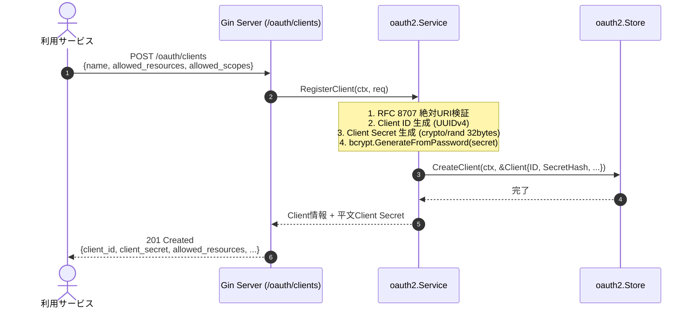
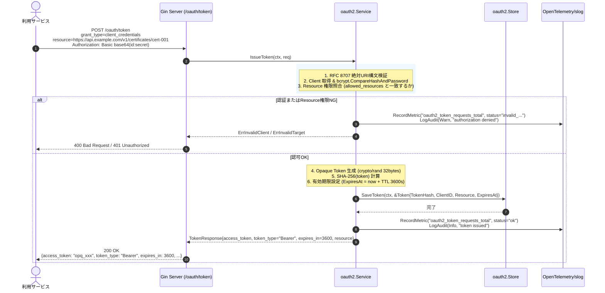
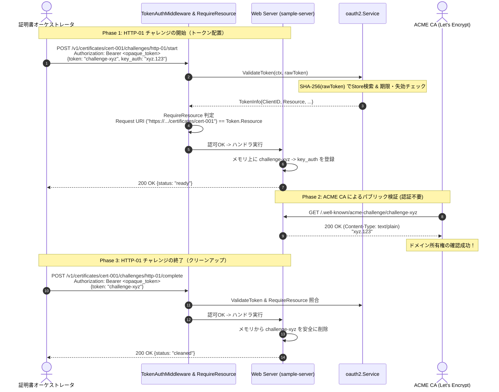
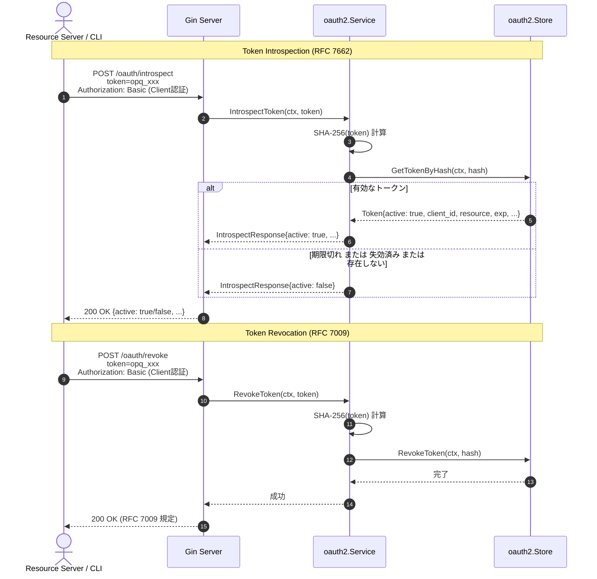

# OAuth 2.0 Client Credentials Grant & ACME Challenge 保護仕様書

本ドキュメントは、Go (Gin) を用いた **OAuth 2.0 Client Credentials Grant (RFC 6749)**、**RFC 8707 (Resource Indicators for OAuth 2.0)**、および **ACME HTTP-01 Challenge (RFC 8555)** の連携アーキテクチャ、セキュリティ設計、OpenTelemetry可観測性仕様、およびシーケンス定義を規定します。

---

## 1. 概要とアーキテクチャ

### 1.1 背景と目的
マイクロサービス間通信（M2M: Machine-to-Machine）において、高特権なAPI（特に ACME Challenge の実行・終了やドメイン検証用トークンの配置）を安全に保護するため、以下の要件を満たす認可機構を構築します：
- **Client Credentials Grant (RFC 6749)**: 人間の介在しないサービス間認証。
- **Resource Indicators (RFC 8707)**: アクセス対象の証明書・チャレンジを「絶対URI」として指定し、最小権限の原則（PoLP）を強制。
- **Opaque Token & SHA-256 保存**: クライアントには暗号学的ランダム文字列（不透明トークン）を返却し、DB/ストレージには SHA-256 ハッシュ値のみをインデックス保存。
- **ACME HTTP-01 チャレンジ保護 (RFC 8555)**: `/.well-known/acme-challenge/` へのファイル配置・削除APIを対象証明書のResourceトークンでのみ操作可能とする。
- **OpenTelemetry & 監査ログ**: 認可成功（OK）および認可失敗（NG）の双方で、メトリクス・トレース・監査ログを完全計装。

---

## 2. 準拠プロトコルと標準仕様

| プロトコル / RFC | 規格名 | 本実装における役割 |
| :--- | :--- | :--- |
| **RFC 6749** | The OAuth 2.0 Authorization Framework | Section 4.4 Client Credentials Grant によるサービス間認証・トークン発行 |
| **RFC 8707** | Resource Indicators for OAuth 2.0 | トークン要求時パラメータ `resource`（フラグメントなしの絶対URI）の検証とリソースバインド |
| **RFC 3986** | Uniform Resource Identifier (URI): Generic Syntax | `resource` パラメータの構文検証（Scheme, Host, Path を含む絶対URI） |
| **RFC 7662** | OAuth 2.0 Token Introspection | トークンの有効性・紐づくClient/Resource/Scopeを照会するエンドポイント |
| **RFC 7009** | OAuth 2.0 Token Revocation | 発行済みトークンの安全な失効（無効化） |
| **RFC 8555** | Automatic Certificate Management Environment (ACME) | Section 8.3 HTTP-01 Challenge の開始（プロビジョニング）および終了（クリーンアップ） |

---

## 3. セキュリティアーキテクチャ

```
┌─────────────────────────────────────────────────────────────┐
│                    Security Architecture                    │
├──────────────────────────────┬──────────────────────────────┤
│ 1. Client Secret             │ bcrypt (Cost 10) でハッシュ化して保存 │
│                              │ 発行時のみ平文返却（一度きり表示）       │
├──────────────────────────────┼──────────────────────────────┤
│ 2. Opaque Token              │ crypto/rand で 256bit 生成   │
│                              │ base64.RawURLEncoding (43文字)│
├──────────────────────────────┼──────────────────────────────┤
│ 3. Token Storage             │ 平文保存禁止。SHA-256 ハッシュを   │
│                              │ ユニークインデックスとして保存(Stripe方式)│
├──────────────────────────────┼──────────────────────────────┤
│ 4. Resource Validation       │ RFC 8707 絶対URI構文を厳格チェック│
│                              │ クライアント認可URIリストと完全照合 │
└──────────────────────────────┴──────────────────────────────┘
```

---

## 4. OpenTelemetry (OTel) & 監査ログ仕様

認可OKおよび認可NGの双方で、一貫した可観測性とセキュリティ監査証跡を担保します。

### 4.1 Metrics (`go.opentelemetry.io/otel/metric`)

| メトリクス名 | タイプ | ラベル (Low-Cardinality) | 説明 |
| :--- | :--- | :--- | :--- |
| `oauth2_token_requests_total` | Counter | `status`: `ok`, `invalid_client`, `invalid_resource`, `invalid_grant`, `error` | トークン発行エンドポイントの試行総数 |
| `oauth2_auth_checks_total` | Counter | `status`: `ok`, `missing_token`, `invalid_token`, `expired_token`, `resource_mismatch`, `scope_mismatch` | ミドルウェアでの認可判定総数 |
| `oauth2_token_duration_seconds` | Histogram | `operation`: `issue_token`, `verify_token` | トークン処理・ハッシュ計算のレイテンシ |

### 4.2 Traces (`go.opentelemetry.io/otel/trace`)

Span: `oauth2.issue_token`, `oauth2.authorize_request`
- **認可OK時**:
  - `oauth2.status = "ok"`
  - `oauth2.client_id = "<client_id>"`
  - `oauth2.resource = "<target_resource_uri>"`
- **認可NG時**:
  - `oauth2.status = "error"`
  - `oauth2.error_reason = "<missing_token | invalid_token | ...>"`
  - `span.RecordError(err)`
  - `span.SetStatus(codes.Error, reason)`

### 4.3 構造化監査ログ (`log/slog`)

全ての認可判定において、`log_type: "audit"` 属性を付与した構造化ログを出力します：
- **平文トークン・シークレットは完全マスキング**（ログへの出力厳禁）。
- 成功時: `LevelInfo`, `msg: "OAuth2 authorization granted"`, `client_id`, `resource`, `method`, `path`, `remote_ip`
- 失敗時: `LevelWarn`, `msg: "OAuth2 authorization denied"`, `error_reason`, `resource`, `method`, `path`, `remote_ip`

---

## 5. プロトコルシーケンス図 (Mermaid)

### Sequence 1: クライアント利用申請 (Client Registration)

外部サービスがOAuthクライアントとしての利用を申請し、認証情報（ID/Secret）を取得します。



---

### Sequence 2: トークン発行 (Client Credentials Grant with RFC 8707 Resource)

利用サービスが、アクセス対象の証明書URIを `resource` として指定し、Opaque Tokenを取得します。



---

### Sequence 3: ACME HTTP-01 チャレンジ実行・検証・終了シーケンス

証明書オーケストレータが Opaque Token を用いて Web サーバー上の ACME Challenge を制御し、外部 ACME サーバー（Let's Encrypt 等）が検証を行います。



---

### Sequence 4: トークン検証 (Introspection) & 失効 (Revocation)

Resource Server や管理ツールがトークンの有効状態を確認、または不要になったトークンを破棄します。


